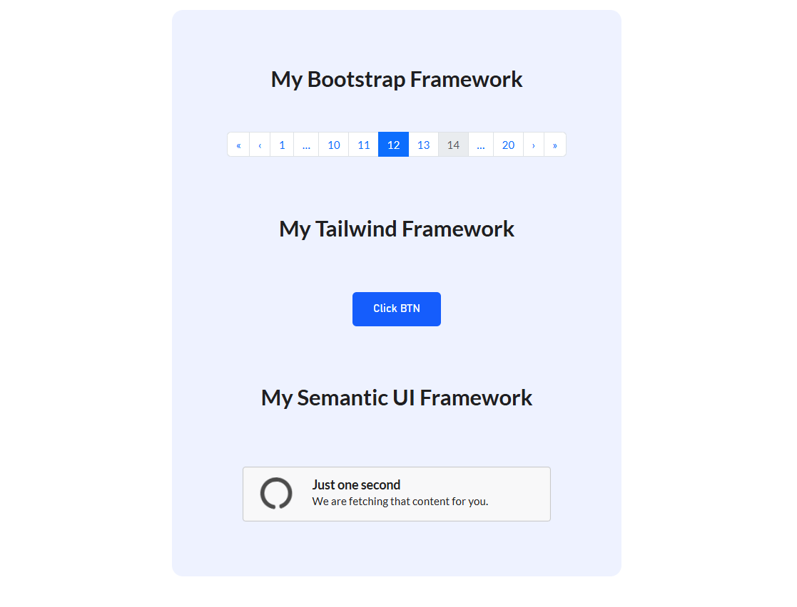

# React + Vite

Building A project  using Multiple framework And Display one component with Each framework. Exploring the methods of installing , writing & structure Of Each Framework.

## Goals:

- using three framework : Done.
- using compentent of each & print it: Done.

## Framework Used:

- Tailwind CSS
- Semantic UI 
- Bootstrap 

## Display content:

